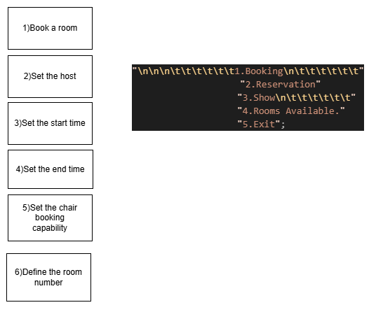
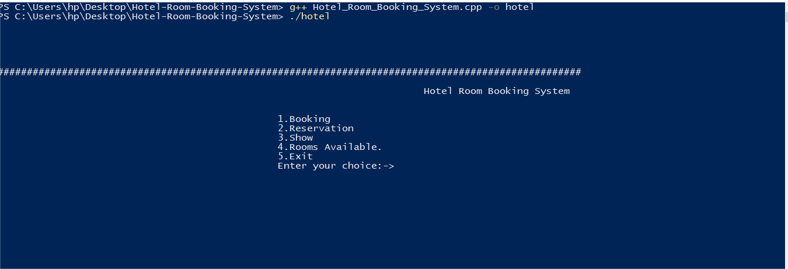
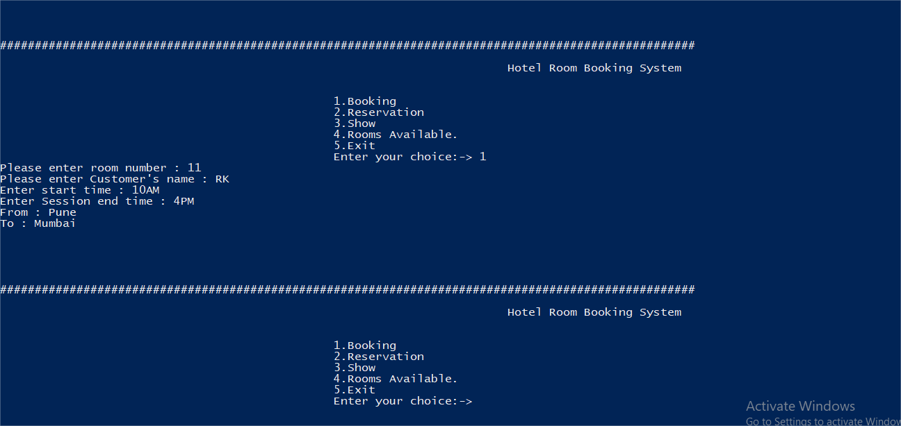
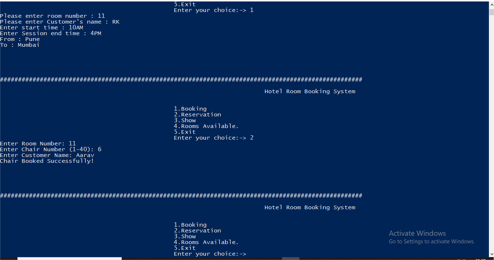
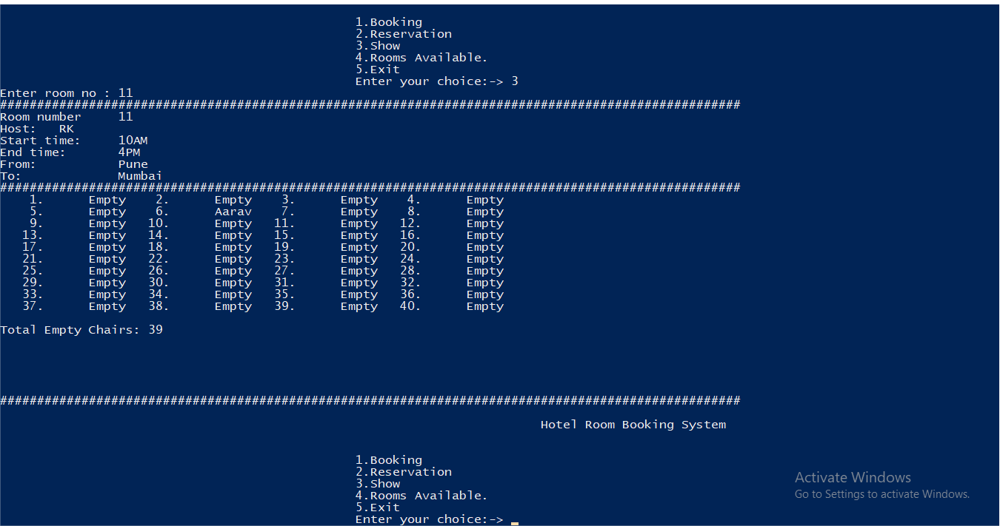
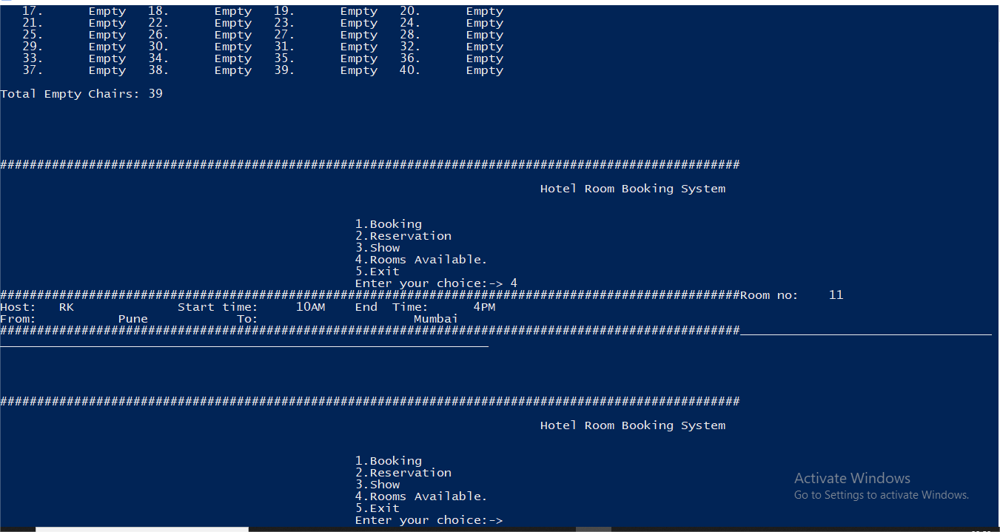

# Room Allotment and Booking System (C++)

Internship Project – IS Robotics

This project is a console-based Room Allotment and Booking System developed using C++ during my internship.

--------------------------------------------

PROBLEM STATEMENT

The system is designed to:

- Book a room
- Set host details
- Schedule start and end time
- Define room number
- Allocate chairs (1–40 seats)
- Check room status
- Manage room availability

--------------------------------------------

TECHNOLOGIES USED

- C++
- Object-Oriented Programming (OOP)
- File Handling
- 2D Arrays
- Menu-driven CLI

--------------------------------------------

SYSTEM DIAGRAM

--------------------------------------------

PROGRAM EXECUTION (OUTPUT)

Step 1 – Main Menu  

Step 2 – Room Booking  

Step 3 – Chair Allocation  

Step 4 – Display Room Details  

Step 5 – Available Rooms  

--------------------------------------------

HOW TO RUN

Compile:
g++ Hotel_Room_Booking_System.cpp -o hotel

Run:
./hotel

--------------------------------------------

KEY LEARNINGS

- Implementation of Data Structures
- Practical use of OOP concepts
- File handling in C++
- Designing menu-driven applications
